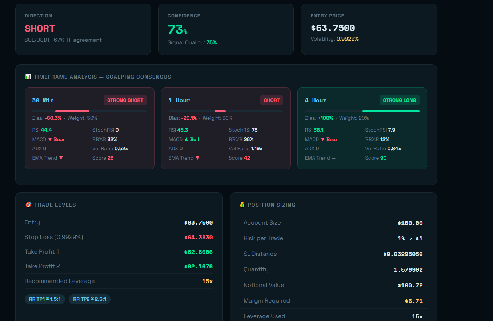

# Crypto Signal Bot System
 ...no api needed just php version 8.4+

An advanced cryptocurrency scalping signal system designed to generate multi-timeframe trading opportunities for various digital assets.


## Signal Example



## Features

* Supports **SOL, ETH, XRP, ADA, PEPE, and HYPE**
* Multi-timeframe analysis:

  * 30 Minutes (50% weight)
  * 1 Hour (30% weight)
  * 4 Hours (20% weight)
* Technical indicators:

  * RSI
  * Stochastic RSI
  * MACD
  * Bollinger %B
  * ADX
  * EMA 9/21/50 Cloud
  * Volume Ratio
  * Linear Regression
* Weighted consensus engine for LONG and SHORT signals
* Agreement count and directional bias detection
* Scalp-optimized stop losses and take profits
* Higher leverage recommendations based on volatility

## Requirements

* PHP **8.4 or higher**
* Internet connection
* Web server:

  * XAMPP (Localhost)
  * Shared Hosting
  * VPS/Dedicated Server

## Installation (XAMPP)

1. Download the ZIP package.
2. Copy the ZIP file into:

```
xampp/htdocs/
```

3. Extract the ZIP file.

Example:

```
xampp/htdocs/crypto-signal-bot/
```

4. Start **Apache** from the XAMPP Control Panel.

5. Open your browser and navigate to:

```
http://localhost/crypto-signal-bot/rp.php
```

## Installation (Online Hosting)

1. Upload the ZIP file to your hosting account's root directory:

```
public_html/
```

or your desired subfolder.

2. Extract the ZIP file using your hosting File Manager.

3. Ensure your hosting environment uses **PHP 8.4**.

4. Open your browser and navigate to:

```
https://yourdomain.com/rp.php
```

or

```
https://yourdomain.com/folder-name/rp.php
```

depending on where the files were extracted.

## Usage

After opening `rp.php`, select the desired cryptocurrency pair and review the generated trading signals.

The system analyzes multiple timeframes and indicators to provide scalp-oriented LONG and SHORT opportunities together with recommended risk management parameters.

## Disclaimer

This software is provided for educational and informational purposes only. Cryptocurrency trading involves substantial risk, and past performance does not guarantee future results.

Users are solely responsible for their trading decisions and risk management.

## Support and Custom Development

Need more advanced features?

I am available for freelance development involving:

* Optimized signal systems
* Arbitrage bots
* Auto-trading bots
* Trading dashboards
* Custom financial automation tools

If you have work opportunities or project inquiries, please contact:

**Email:** [joegatimu20@gmail.com](mailto:joegatimu20@gmail.com)

Thank you for supporting independent developers.

# Disclaimer

This software is provided for educational, informational, and research purposes only.

The signals, analytics, indicators, leverage suggestions, and risk parameters generated by this application do **not** constitute financial, investment, legal, or professional advice. Cryptocurrency markets are highly volatile, and trading digital assets carries significant risk, including the possible loss of all invested capital.

By using this software, you acknowledge and agree that:

* You are solely responsible for your trading decisions.
* You should conduct your own independent research before entering any trade.
* Past performance and historical data do not guarantee future results.
* The developer, contributors, and distributors of this software shall not be held liable for any direct, indirect, incidental, consequential, or special damages arising from the use or inability to use this application.
* No guarantees or warranties, express or implied, are provided regarding the accuracy, completeness, reliability, availability, profitability, or suitability of any signals or information produced by the system.
* Market conditions, exchange limitations, data interruptions, internet connectivity issues, software defects, and third-party service disruptions may affect the operation and outputs of the application.

This project may utilize external services, publicly available market data sources, and open-source components to facilitate functionality. The respective owners retain all rights to their services and technologies.

Use of this software indicates your acceptance of this disclaimer and your understanding of the risks associated with cryptocurrency trading.

If you do not agree with these terms, you should discontinue use of the software immediately.

